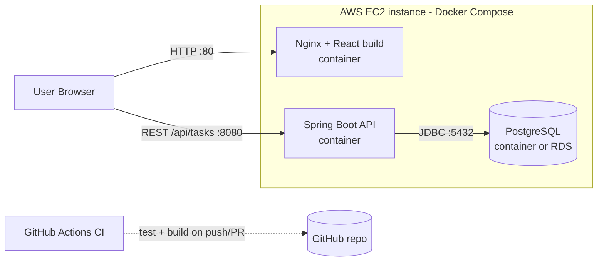

# Cloud Task Manager

A small full-stack task manager built to be deployed to the cloud: React + Spring Boot + PostgreSQL, containerised with Docker, tested and built by GitHub Actions, deployable to a single AWS EC2 instance.

## Features
Create, list, view-by-ID, update, delete and search (by title) tasks. Each task has `id`, `title`, `description`, `status` (`TODO`, `IN_PROGRESS`, `COMPLETED`) and `createdAt`.

## Tech stack
| Layer | Technology |
|---|---|
| Frontend | React 18, Vite 5, Axios, served by Nginx in production |
| Backend | Java 17, Spring Boot 3.3, Spring Web, Spring Data JPA, Bean Validation, Maven |
| Database | PostgreSQL 16 (H2 in-memory for tests only) |
| DevOps | Docker (multi-stage), Docker Compose, GitHub Actions, AWS EC2 |

## Architecture



The React app runs in the browser and calls the API directly, so `VITE_API_BASE_URL` must be a URL the **browser** can reach, and the backend must allow the frontend's origin via `CORS_ALLOWED_ORIGINS`.

## Folder structure
```
cloud-task-manager/
├── backend/                 Spring Boot API (pom.xml, Dockerfile, src/)
│   └── src/test/            H2-based tests (profile "test")
├── frontend/                React + Vite app (Dockerfile, nginx.conf, src/)
├── docker-compose.yml       db + backend + frontend
├── .env.example             template for Compose variables
└── .github/workflows/ci.yml GitHub Actions pipeline
```

## Environment variables
**Backend**
| Variable | Purpose | Default |
|---|---|---|
| `SPRING_DATASOURCE_URL` | JDBC URL | *required* |
| `SPRING_DATASOURCE_USERNAME` | DB user | *required* |
| `SPRING_DATASOURCE_PASSWORD` | DB password | *required* |
| `SERVER_PORT` | API port | `8080` |
| `CORS_ALLOWED_ORIGINS` | Comma-separated allowed origins | *required* |

**Frontend** (build time): `VITE_API_BASE_URL` – backend base URL without `/api`, e.g. `http://localhost:8080`.

**Compose** (`.env`): `POSTGRES_DB`, `POSTGRES_USER`, `POSTGRES_PASSWORD`, `CORS_ALLOWED_ORIGINS`, `VITE_API_BASE_URL`.

## API
| Method | Path | Description |
|---|---|---|
| POST | `/api/tasks` | Create (201) |
| GET | `/api/tasks` | List all |
| GET | `/api/tasks/{id}` | Get one (404 if missing) |
| PUT | `/api/tasks/{id}` | Update |
| DELETE | `/api/tasks/{id}` | Delete (204) |
| GET | `/api/tasks/search?title=...` | Case-insensitive partial title search |

Body: `{"title":"Write report","description":"...","status":"TODO"}` (`title` required; `status` defaults to `TODO`).

## Local setup (without Docker)
Prerequisites: JDK 17, Maven 3.9+, Node 20+, PostgreSQL.

**Maven wrapper**: `backend/mvnw` is a small script that downloads Maven 3.9.9 on first use (needs `curl` or `wget`; on Windows use Git Bash or WSL). No separate Maven install is needed.

**Database**
```bash
psql -U postgres -c "CREATE USER taskuser WITH PASSWORD 'change-me';"
psql -U postgres -c "CREATE DATABASE taskdb OWNER taskuser;"
```

**Run backend**
```bash
cd backend
export SPRING_DATASOURCE_URL=jdbc:postgresql://localhost:5432/taskdb
export SPRING_DATASOURCE_USERNAME=taskuser
export SPRING_DATASOURCE_PASSWORD=change-me
export CORS_ALLOWED_ORIGINS=http://localhost:5173
./mvnw spring-boot:run          # http://localhost:8080/api/tasks
```

**Run frontend**
```bash
cd frontend
cp .env.example .env
npm install
npm run dev                     # http://localhost:5173
```

## Run tests
```bash
cd backend && ./mvnw test
```
Tests use an in-memory H2 database via `application-test.yml` (`@ActiveProfiles("test")`), so no PostgreSQL is needed.

## Docker
**Everything with Compose (recommended)**
```bash
cp .env.example .env            # edit the password
docker compose up -d --build
# Frontend: http://localhost   API: http://localhost:8080/api/tasks
docker compose logs -f backend
docker compose down             # add -v to also delete DB data
```

**Build images individually**
```bash
docker build -t task-backend ./backend
docker build -t task-frontend --build-arg VITE_API_BASE_URL=http://localhost:8080 ./frontend
```

**Run containers individually**
```bash
docker network create taskNet
docker run -d --name db --network taskNet -e POSTGRES_DB=taskdb -e POSTGRES_USER=taskuser \
  -e POSTGRES_PASSWORD=change-me -v pgdata:/var/lib/postgresql/data postgres:16-alpine
docker run -d --name backend --network taskNet -p 8080:8080 \
  -e SPRING_DATASOURCE_URL=jdbc:postgresql://db:5432/taskdb \
  -e SPRING_DATASOURCE_USERNAME=taskuser -e SPRING_DATASOURCE_PASSWORD=change-me \
  -e SERVER_PORT=8080 -e CORS_ALLOWED_ORIGINS=http://localhost task-backend   # replace with your frontend origin
docker run -d --name frontend -p 80:80 task-frontend
```

## GitHub Actions CI
`.github/workflows/ci.yml` runs on every push and pull request with two jobs:
1. **backend** – checkout, Java 17 (Temurin, Maven cache), `mvn -B verify` (compiles and runs all tests).
2. **frontend** – checkout, Node 20, `npm install`, `npm run build`.

A failing test or build fails the workflow.

## Deploy to AWS EC2

The simplest reliable setup is one EC2 instance running all three containers with Docker Compose.

1. **Launch instance**: Amazon Linux 2023, `t3.small` (2 GB RAM recommended; `t2.micro` may be too small for the Maven build), 20 GB disk, create/download a key pair.
2. **Security group** inbound rules: SSH 22 (*My IP* only), HTTP 80 (anywhere), Custom TCP 8080 (anywhere). **Do not open 5432.**
3. **Connect and install Docker**
   ```bash
   ssh -i key.pem ec2-user@<EC2_PUBLIC_IP>
   sudo dnf install -y docker git
   sudo systemctl enable --now docker
   sudo usermod -aG docker ec2-user
   sudo mkdir -p /usr/local/lib/docker/cli-plugins
   sudo curl -SL https://github.com/docker/compose/releases/latest/download/docker-compose-linux-x86_64 \
     -o /usr/local/lib/docker/cli-plugins/docker-compose
   sudo chmod +x /usr/local/lib/docker/cli-plugins/docker-compose
   exit    # log back in so the docker group applies
   ```
4. **Get the code and configure**
   ```bash
   git clone https://github.com/<you>/cloud-task-manager.git && cd cloud-task-manager
   cp .env.example .env && nano .env
   ```
   Set `POSTGRES_PASSWORD` to a strong value, `CORS_ALLOWED_ORIGINS=http://<EC2_PUBLIC_IP>` and `VITE_API_BASE_URL=http://<EC2_PUBLIC_IP>:8080`.
5. **Start**: `docker compose up -d --build`
6. **Verify**: open `http://<EC2_PUBLIC_IP>` and `http://<EC2_PUBLIC_IP>:8080/api/tasks`.

**Using AWS RDS PostgreSQL instead of the DB container**: create an RDS PostgreSQL instance whose security group allows port 5432 from the EC2 security group only. Remove the `db` service (and `depends_on`) from `docker-compose.yml`, and set the backend's `SPRING_DATASOURCE_URL=jdbc:postgresql://<rds-endpoint>:5432/taskdb` plus the RDS username/password.

**Update the deployed app**
```bash
cd ~/cloud-task-manager && git pull && docker compose up -d --build
docker image prune -f
```
If you change `VITE_API_BASE_URL`, rebuild the frontend: `docker compose build --no-cache frontend && docker compose up -d`.

## Cloud architecture summary
- **Compute**: one EC2 instance, three containers on a private Docker network.
- **Network**: only ports 80 (UI) and 8080 (API) are public; PostgreSQL is reachable only from the backend container.
- **Data**: PostgreSQL data lives in the `pgdata` Docker volume (or RDS for managed backups).
- **Config**: all secrets and URLs come from environment variables; nothing is hardcoded.
- **CI**: GitHub Actions validates every change before deploying.
