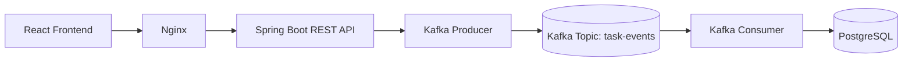

# Cloud Task Manager (Event-Driven Architecture with Apache Kafka)

A full-stack task manager application enhanced with an **Apache Kafka event-driven pipeline**: React + Nginx + Spring Boot + Apache Kafka + PostgreSQL, fully containerised with Docker Compose and tested via GitHub Actions.

## Assignment Demonstration & Core Concepts
This project demonstrates key principles of **Event-Driven Thinking** and modern distributed system patterns:
- **Distributed Communication**: Decoupled asynchronous event delivery using Apache Kafka.
- **Message Passing & Delivery**: Structured JSON event payloads published to Kafka topics.
- **Event-Driven Architecture**: Task mutations (Create, Update, Delete) produce audit events asynchronously without blocking synchronous HTTP REST API responses.
- **Kafka Producer/Consumer Pattern**: In-process Spring Kafka Producer publishes events to topic `task-events`, consumed by a Kafka Consumer logger/processor.
- **Containerization**: Single-command local dev environment using Docker Compose containing `frontend`, `backend`, `kafka` (KRaft mode), and `postgres`.

---

## Tech Stack
| Layer | Technology |
|---|---|
| Frontend | React 18, Vite 5, Axios, served by Nginx in production |
| Backend | Java 17/25, Spring Boot 3.3, Spring Web, Spring Data JPA, Spring Kafka, Maven |
| Messaging | Apache Kafka 3.7 (KRaft mode, single-node) |
| Database | PostgreSQL 16 (H2 in-memory for unit tests) |
| DevOps | Docker (multi-stage), Docker Compose, GitHub Actions |

---

## System Architecture



### Event Flow Scenario
1. **User Action**: User creates, updates, or deletes a task in the React frontend.
2. **REST Request**: Nginx routes the HTTP request to Spring Boot (`/api/tasks`).
3. **Database CRUD**: Task state is synchronously saved/updated/deleted in PostgreSQL.
4. **Kafka Event Publishing**: Spring Boot `TaskEventProducer` packages event metadata and publishes a JSON message to Kafka topic `task-events`.
5. **Kafka Processing**: `TaskEventConsumer` receives the event asynchronously from `task-events` and logs/processes it.

---

## Kafka Events Specification

Topic Name: `task-events`

### Supported Events
- `TaskCreated`: Fired upon task creation (`POST /api/tasks`)
- `TaskUpdated`: Fired upon task update (`PUT /api/tasks/{id}`)
- `TaskDeleted`: Fired upon task deletion (`DELETE /api/tasks/{id}`)

### Event Payload Schema (JSON)
```json
{
  "eventType": "TaskCreated",
  "taskId": 1,
  "title": "Write quarterly report",
  "status": "TODO",
  "timestamp": "2026-10-04T20:30:00Z",
  "details": "Task created via API"
}
```

---

## Environment Variables

| Variable | Purpose | Default |
|---|---|---|
| `POSTGRES_DB` | PostgreSQL database name | `taskdb` |
| `POSTGRES_USER` | PostgreSQL user | `taskuser` |
| `POSTGRES_PASSWORD` | PostgreSQL password | `change-me` |
| `SPRING_KAFKA_BOOTSTRAP_SERVERS` | Kafka broker host:port | `kafka:9092` |
| `KAFKA_TOPIC` | Kafka topic for task events | `task-events` |
| `SERVER_PORT` | Backend port | `8080` |
| `CORS_ALLOWED_ORIGINS` | CORS allowed origins | `http://localhost` |
| `VITE_API_BASE_URL` | Frontend API endpoint | `http://localhost:8080` |

---

## Folder Structure
```
cloud-task-manager/
├── backend/                 Spring Boot API + Kafka Producer/Consumer
│   ├── src/main/java/       Task REST Controller, Service, JPA Entity, Kafka Event Producer & Consumer
│   └── src/test/java/       JUnit 5 unit tests (MockMvc, TaskEventProducerTest, TaskEventConsumerTest)
├── frontend/                React + Vite UI served via Nginx
├── docker-compose.yml       Orchestrates postgres, kafka, backend, and frontend
├── .env.example             Template for environment variables
└── README.md                Documentation & Architecture Overview
```

---

## Running locally with Docker Compose

1. **Copy Environment Variables**:
   ```bash
   cp .env.example .env
   ```

2. **Start All Services**:
   ```bash
   docker compose up -d --build
   ```

3. **Verify Container Health**:
   ```bash
   docker compose ps
   ```

4. **Access Applications**:
   - **Frontend UI**: `http://localhost`
   - **Backend API**: `http://localhost:8080/api/tasks`

---

## How to Verify Kafka Events

### Option A: Inspect Backend Container Logs
Create, update, or delete a task through the frontend or `curl`:
```bash
curl -X POST http://localhost:8080/api/tasks \
  -H "Content-Type: application/json" \
  -d '{"title":"Test Kafka Pipeline","description":"Verification task","status":"TODO"}'
```

View the live backend logs to observe both Producer and Consumer activity:
```bash
docker compose logs -f backend
```

**Expected Log Output**:
```text
[KAFKA PRODUCER] Published TaskCreated event: taskId=1
[KAFKA CONSUMER] Received TaskCreated event: taskId=1
[KAFKA CONSUMER] Event Payload: title="Test Kafka Pipeline", status=TODO, timestamp=2026-10-04T20:45:00Z, details="Task created via API"
```

### Option B: Read Messages Directly from Kafka Container
Execute `kafka-console-consumer` inside the Kafka container:
```bash
docker exec -it task-kafka /opt/kafka/bin/kafka-console-consumer.sh \
  --bootstrap-server localhost:9092 \
  --topic task-events \
  --from-beginning
```

---

## Running Unit Tests Locally

```bash
cd backend
./mvnw test
```

Tests run using an in-memory H2 database with Kafka producer/consumer components mocked or tested in isolation. No running Kafka instance or PostgreSQL is required for unit test execution.
